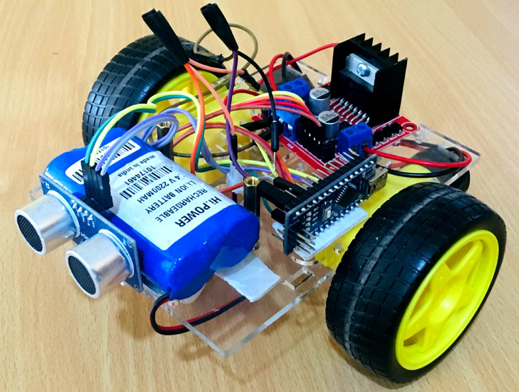

# OBSTACLES AVOIDING ROBOT

Obstacle Avoiding Robot is an intelligent device which can automatically sense the obstacle in front of it and avoid them by turning itself

<p align="center"></p>

## Credits

All credits goes to a website [https://create.arduino.cc/projecthub](https://create.arduino.cc/projecthub)
refer from their original post [Obstacle avoiding Robot](https://create.arduino.cc/projecthub/Alfa0420/obstacle-avoiding-robot-using-arduino-and-ultrasonic-sensor-c179bb)

## What you will need.

| NAME                                         | QTY |
| -------------------------------------------- | --- |
| Arduino UNO board.                           |  1  |
| SparkFun Ultrasonic Sensor - HC-SR04         |  1  |
| SparkFun Dual H-Bridge Motor drivers LM298N  |  1  |
| 9V battery (generic)                         |  1  |
| Male to Male and Make to Female jumper wires |  20 |
| Breadboard                                   |  1  |
| Wheels                                       |  2  |
| Chasis                                       |  1  |

## About this project
### How Ultrasonic sensor can be used to avoid obstacles

> <p>Before going to build the robot, it is important to understand how the ultrasonic sensor works because this sensor will have important role in detecting obstacle. The basic principle behind the working of ultrasonic sensor is to note down the time taken by sensor to transmit ultrasonic beams and receiving the ultrasonic beams after hitting the surface. Then further the distance is calculated using the formula. In this project, the widely available <strong>HC-SR04 Ultrasonic Sensor</strong> is used. To use this sensor, similar approach will be followed explained above.</p>
> <p align="center"></p>
> <p>So, the Trig pin of HC-SR04 is made high for at least 10 us. A sonic beam is transmitted with 8 pulses of 40KHz each.</p>
> <p align="center"></p>
> <p>The signal then hits the surface and return back and captured by the receiver Echo pin of HC-SR04. The Echo pin had already made high at the time sending high.</p>
> <p align="center"></p>
> <p>The time taken by beam to return back is saved in variable and converted to distance using appropriate calculations like below:</p>
> <p align = "center"><b>Distance= (Time x Speed of Sound in Air (343 m/s))/2</b></p>

## Schematics

> <p align="center"></p>

## Programming Arduino for obstacle avoiding robot

> <p><b>Complete program with a demonstration video</b> is given at the end of this readME. this program will include setting up HC-SR04 module and outputting the signals to motor pins to move motor direction accordingl. No libraries will be used in this project</p>

> 1.  <P>First <b>define trig and echo pin of HC-SR04</b> in the program. In this project the trig pin is connected to GPIO9 and echo pin is connected to GPIO10 of Arduino NANO.</P>

```
    int trigPin = 9;      // trig pin of HC-SR04
    int echoPin = 10;     // Echo pin of HC-SR04
```

> 2.  <P><b>Define pins for input of LM298N Motor Driver Module</b>. The LM298N has 4 data input pins used to control the direction of motor connected to it</P>

```
    int revleft4 = 4;       //REVerse motion of Left motor
    int fwdleft5 = 5;       //ForWarD motion of Left motor
    int revright6 = 6;      //REVerse motion of Right motor
    int fwdright7 = 7;      //ForWarD motion of Right motor
```

> 3.  <P>In setup() function, <b>define the data direction of utilised GPIO pins</b>. The four Motor pins and Trig pin is set as OUTPUT and Echo Pin is set as Input.</P>

```
   pinMode(revleft4, OUTPUT);      // set Motor pins as output
   pinMode(fwdleft5, OUTPUT);
   pinMode(revright6, OUTPUT);
   pinMode(fwdright7, OUTPUT);
   pinMode(trigPin, OUTPUT);         // set rig pin as output
   pinMode(echoPin, INPUT);          //set echo pin as input to capture reflected waves
```

> 4.  <P>In loop() function, <b>get the distance from HC-SR04</b> and based on the distance move the motor direction. The distance will show the object distance coming in front of the robot. The Distance is taken by bursting a beam of ultrasonic up to 10 us and receiving it after 10us. To learn more about measuring distance using Ultrasonic sensor and Arduino, follow the link.</P>

```
   digitalWrite(trigPin, LOW);
   delayMicroseconds(2);
   digitalWrite(trigPin, HIGH);     // send waves for 10 us
   delayMicroseconds(10);
   duration = pulseIn(echoPin, HIGH); // receive reflected waves
   distance = duration / 58.2;   // convert to distance
   delay(10);
```

> <P>If the distance is greater than the defined distance means there is not obstacle in its path and it will moving in forward direction.</P>

```
   if (distance > 19)
        {
            digitalWrite(fwdright7, HIGH);                    // move forward
            digitalWrite(revright6, LOW);
            digitalWrite(fwdleft5, HIGH);
            digitalWrite(revleft4, LOW);
        }
```

> <P>If the distance is less than the defined distance to avoid obstacle means <b>there is some obstacle ahead</b>. So in this situation robot will stop for a while and movebackwards after that again stop for a while and then take turn to another direction.</P>

```
   if (distance < 18)
        {
            digitalWrite(fwdright7, LOW);  //Stop
            digitalWrite(revright6, LOW);
            digitalWrite(fwdleft5, LOW);
            digitalWrite(revleft4, LOW);
            delay(500);
            digitalWrite(fwdright7, LOW);      //movebackward
            digitalWrite(revright6, HIGH);
            digitalWrite(fwdleft5, LOW);
            digitalWrite(revleft4, HIGH);
            delay(500);
            digitalWrite(fwdright7, LOW);  //Stop
            digitalWrite(revright6, LOW);
            digitalWrite(fwdleft5, LOW);
            digitalWrite(revleft4, LOW);
            delay(100);
            digitalWrite(fwdright7, HIGH);
            digitalWrite(revright6, LOW);
            digitalWrite(revleft4, LOW);
            digitalWrite(fwdleft5, LOW);
            delay(500);
        }
```

> <P>this is how a robot can avoid obstacles in its path without getting stuck anywhere.</P>

## Video
<p align="center"><a href="https://youtu.be/qe9fxxvoEKQ"></a></p>